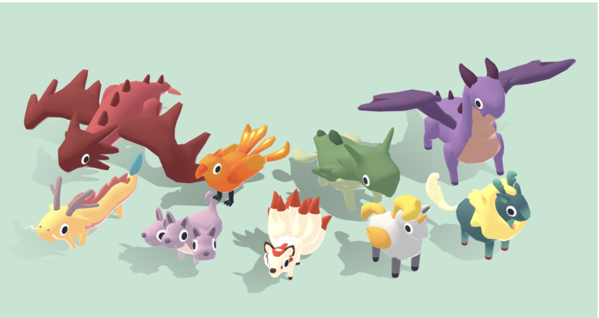

# Summary

After surveying lots of 3D models, I have concluded that it is possible to capture the charm of 2D but it is a highly technical skill. A list of different aesthetics that I've identified are below, and galleries can be found on [sketchfab](https://sketchfab.com/snarkishark/collections) and [behance](https://www.behance.net/elisabewilliam5/moodboards)

I think we can reasonably accomplish something like a minimalist/vector look with selective hand painted texturing.

For example, [Priichu's Eileen the Crow](https://skfb.ly/VTUt) only has detailed texturing on the cape and blades, and smooth planes of color for the other elements.

# Overview of Styles

## 2D Illustration

https://skfb.ly/6SFE8
This aesthetic tricks us into thinking it's 2D. It is quite amazing and beautiful.

| Defining Features                                    | Pros                                                              | Cons                              |
| ------------------------------------------------------ | ------------------------------------------------------------------- | ----------------------------------- |
| Looks like a traditional illustration from any angle | - Extremely beautiful! - Can be low poly                       | - Raw artistic talent, seems hard |
| Rich textures                                        | -[Shahriar Shahrabi](https://skfb.ly/oHKM6) did something amazing | - it is over my head              |

## Toon

https://skfb.ly/6yyAP
Another 2D look, but drawing on cartoons and comics rather than traditional illustration. Characterized by a visible outline of consistent width, it's commonly seen in modern cartoons that attempt to maintain the 2D aesthetic. I would say Borderlands is in this category.

| Defining Features                       | Pros                             | Cons                              |
| ----------------------------------------- | ---------------------------------- | ----------------------------------- |
| Distinct outlines of a consistent width | - can be used on lowpoly sculpts | - outlines can clip in weird ways |

## Pixel Art

https://skfb.ly/6QStT
This style directly replicates the pixel art aesthetic, ranging from minimalist to hi-bit. The look is almost entirely in the textures rather than the sculpts.

| Defining Features  | Pros                                                                 | Cons                                                                                                  |
| -------------------- | ---------------------------------------------------------------------- | ------------------------------------------------------------------------------------------------------- |
| Classic pixel look | - very attractive - low polygon count - looks great on a robot | - labor intensive if going for a hi-bit look - characters look kind of goofy somehow? Hair is hard |

## Pixel Vibe

[Pixel Vibe collection on sketchfab](https://sketchfab.com/snarkishark/collections/pixel-vibe-5e38620a67974167947a0f1db1a4f57a)
Although not strictly pixel art (wrt visible "pixels"), this style is evocative of highly detailed pixel work. Through a combination of palette and shading techniques like cel shading, these pieces feel like they could fit into a [hi-bit pixel game](http://dpadstudio.com/Blog/postHibit.html#shareSection) or older game like WOW classic

| Defining Features      | Pro                                                                                   | Con                                                                                                                              |
| ------------------------ | --------------------------------------------------------------------------------------- | ---------------------------------------------------------------------------------------------------------------------------------- |
| Hand painted texturing | - Very attractive - Can potentially use fewer polygons since texture is painted on | - labor intensive                                                                                                             |
| Set light source       | - allows tight control over colors and shape of shadows                               | - shadows are not responsive - can't do day/night cycles dynamically (I think. Maybe it can be spoofed with like an overlay?) |

## Minimalist/Vector

https://skfb.ly/oFCVA
Despite being called "low-poly", this aesthetic isn't necessarily low on polygons. Additionally, there are many low-poly aesthetics that are not minimalist. This category includes a few distinct visual styles that can show up if you search "low-poly"

| Defining Features      | Pros               | Cons                                                          |
| ------------------------ | -------------------- | --------------------------------------------------------------- |
| Smooth looking sculpts | - simple to sculpt | -  less detail - animation can look stiff                  |
| Flat textures          | - simple to paint  | - relies almost entirely on sculpt/silhouette for personality |

### Subcategories

#### Crystalized

https://skfb.ly/KVOq
This aesthetic is so low on polygons that there are no round shapes. Everything is flat faces, and none have textures on them. Often seen in relaxing idle mobile games. Also Firewatch.

#### Gummy

https://skfb.ly/6tGtN
This aesthetic doesn't quite look like clay, but has a very soft and smooth texture. Often seen in city building and resource management mobile games

#### Smooth Vectors

https://skfb.ly/o6ZRY
Adjacent to the gummy look, but with fewer polygons and a flatter look. Often seen in puzzle games (Untitled Goose Game), but also feels like some corporate training/information videos use this style? Or certain educational videos on youtube. Friendly.

#### Flat

https://skfb.ly/oHsAO
Models have a low polygon count and might fall into the smooth vector or crystalized categories, but this aesthetic is created by the lighting/shaders and is characterized by a very stark, graphic look.

## Edgy Retro

https://www.behance.net/gallery/37715841/Motion-Studies/modules/250498451
Adjacent to the resurgence of "PS1 aesthetic," extremely low poly and uninterested in realism, this aesthetic is all about hard edges, weird angles, and embracing clipping.

| Defining Features        | Pros                | Cons                       |
| -------------------------- | --------------------- | ---------------------------- |
| Extremely low poly count | - easy to make!     | - highly restrictive forms |
| Abstract forms           | - look pretty cool! | - also hard to look at     |